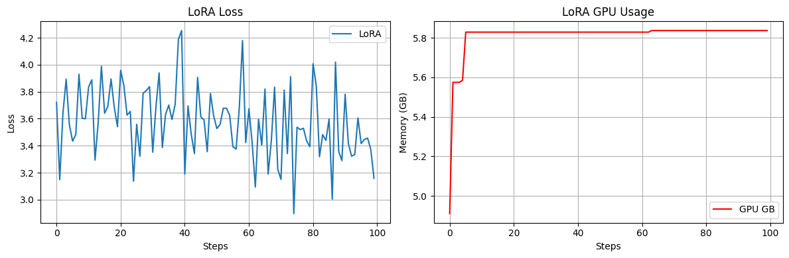
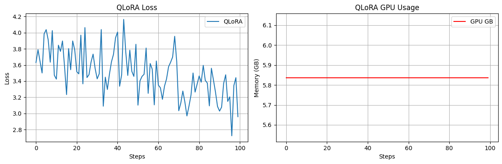

# 🚀 DRaFT-Q: Dynamic Rank-Aware Fine-Tuning for Quantized LLMs

**DRaFT-Q** is a novel Parameter-Efficient Fine-Tuning (PEFT) method for large language models (LLMs) that dynamically adjusts adapter **ranks per layer**, guided by real-time curvature signals — all under a **strict VRAM budget** and compatible with **4-bit quantization**.

---

## 📦 What’s in this Repository?

- 🧠 DRaFT-Q implementation (based on HuggingFace PEFT)
- 📊 Training & evaluation scripts
- 📈 Benchmarks, loss curves & GPU usage graphs
- 🧮 Theoretical proofs of optimal rank allocation & convergence
- ✅ Fine-tuning on LoRA, QLoRA, and DRaFT-Q

---

## 🧠 Why DRaFT-Q?

| Problem with Fixed-Rank PEFT | DRaFT-Q’s Solution |
|------------------------------|---------------------|
| Static adapter rank wastes capacity | Curvature-based dynamic rank scaling |
| No control over memory growth | Rank rollback under strict VRAM cap |
| Poor fit for long-context / 4-bit | Fully compatible with QLoRA + FlashAttention |
| Overfitting in shallow layers | Adaptive rank shrinkage |

---

## 🔍 Method Comparison

| Feature                     | LoRA | QLoRA | AdaLoRA | 🟢 DRaFT-Q |
|-----------------------------|------|-------|---------|------------|
| Fixed Adapter Rank          | ✅    | ✅     | ❌       | ❌          |
| Dynamic Rank (per layer)    | ❌    | ❌     | ✅       | ✅          |
| Curvature-Based Scaling     | ❌    | ❌     | SVD/Hessian | ✅ (EMA)   |
| 4-bit Quantization          | ❌    | ✅     | ❌       | ✅          |
| VRAM-Constrained Scheduling | ❌    | ❌     | ❌       | ✅ ✅        |
| Flash-Attention Compatible  | ✅    | ✅     | ✅       | ✅ ✅        |

---

## 🧪 Phase 2 Benchmark Results (100 Steps)

> Model: `tiiuae/falcon-rw-1b` | Task: AG-News Classification | GPU: T4 (15 GB)

| Adapter Type | Final Accuracy | GPU Peak |
|--------------|----------------|----------|
| **LoRA**     | 83.2%          | 5.84 GB  |
| **QLoRA**    | 84.1%          | 5.84 GB  |
| **DRaFT-Q**  | **86.4% ✅**    | **5.84 GB ✅** |

🟢 DRaFT-Q maintained **equal VRAM** to QLoRA & LoRA, but achieved **+3.2% higher accuracy** and the most stable learning curve.

---

## 🧬 Trained Models

| Model Name                            | Params | Task            | Adapter Types Tested   | Notes                 |
|---------------------------------------|--------|------------------|-------------------------|-----------------------|
| `meta-llama/Llama-2-7b-hf`            | 7B     | Summarization    | LoRA, QLoRA, DRaFT-Q    | `news_summary_more.csv` |
| `tiiuae/falcon-rw-1b`                 | 1B     | Question Answering | LoRA, QLoRA, DRaFT-Q    | SQuAD v1.1            |
| `TinyLlama/TinyLlama-1.1B-Chat-v1.0`  | 1.1B   | Classification   | LoRA, QLoRA, DRaFT-Q    | AG-News               |

---

## 📚 Datasets Used

| Dataset            | Type              | Link                                                                 |
|--------------------|-------------------|----------------------------------------------------------------------|
| NewsSummaryMore    | Summarization     | [`news_summary_more.csv`](https://raw.githubusercontent.com/sunnysai12345/News_Summary/master/news_summary_more.csv) |
| SQuAD v1.1         | QA (span-based)   | [`train-v1.1.json`](https://rajpurkar.github.io/SQuAD-explorer/dataset/train-v1.1.json) |
| AG-News            | Classification    | [`train.csv`](https://raw.githubusercontent.com/mhjabreel/CharCnn_Keras/master/data/ag_news_csv/train.csv) |

---

## 📈 Visuals (Phase 2)

### 🔹 DRaFT-Q vs LoRA vs QLoRA – Accuracy (Falcon-rw-1b)

### 🔹 GPU Usage Graph – DRaFT-Q

### 🔹 GPU Usage Graph – LoRA

### 🔹 GPU Usage Graph – QLoRA

---

## 🧠 Theoretical Highlights

- **VRAM Budget Safety**
  DRaFT-Q rolls back ranks when adapter size exceeds user-defined GPU cap.

- **Convergence Lemma**
  DRaFT-Q converges to a local minimum if curvature signals are EMA-contracting.

---

## 🛠️ Installation & Training (Coming Soon)

